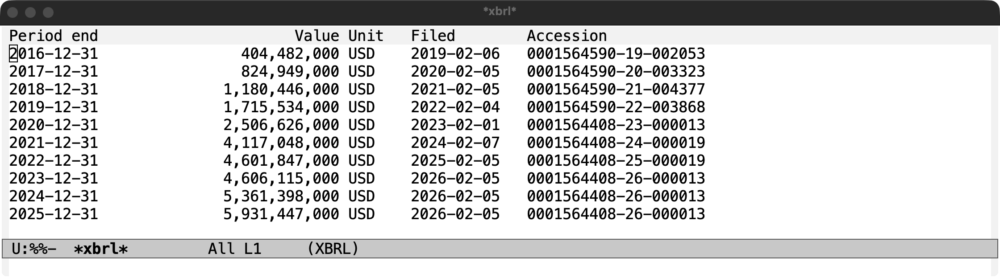

# xbrl.el

Query SEC EDGAR XBRL facts (10-K/10-Q financials) from Emacs via the data.sec.gov JSON APIs.

Features, each with a worked example and screenshot in the [showcase](docs/README.md):

- [Net margin by year](docs/README.md#1-revenue--net-loss--net-margin-by-year): compose revenue and net income into a ratio
- [Concept discovery](docs/README.md#2-discover-concept-names): find the exact tag a company reports under
- [Cross-filer frames](docs/README.md#3-cross-filer-comparison-with-a-frame): one concept for every filer in a period
- [Table browser](docs/README.md#4-browse-a-concept-as-a-table): `M-x xbrl-show-facts`, sortable, with filing accession numbers
- Inline XBRL: read facts straight out of a filing's HTML with `xbrl-inline-facts`

Companion package: [edgar.el](https://github.com/davidawad/edgar.el) reads the filings themselves.

## Install

Emacs 29.1 or newer. Straight from GitHub:

    (package-vc-install "https://github.com/davidawad/xbrl.el")

Or from a checkout: add its directory to `load-path`, then `(require 'xbrl)`.

## Use

    (setq xbrl-user-agent "Your Name you@example.com") ; SEC requires this
    (xbrl-annual "SNAP" "NetIncomeLoss")
    M-x xbrl-show-facts

Scope: SEC XBRL JSON APIs and read-only Inline XBRL fact extraction from an HTML
string via `xbrl-inline-facts`. Inline facts include their context and unit
metadata; this function does not fetch filings.

## Tests

Offline tests (the live test is skipped):

    emacs --batch -Q -L . -l test/xbrl-test.el -f ert-run-tests-batch-and-exit

To include the SEC live test:

    XBRL_LIVE=1 emacs --batch -Q -L . -l test/xbrl-test.el -f ert-run-tests-batch-and-exit
