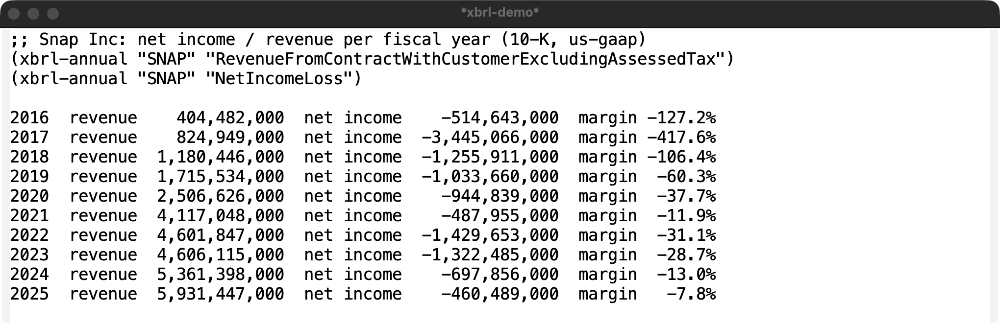
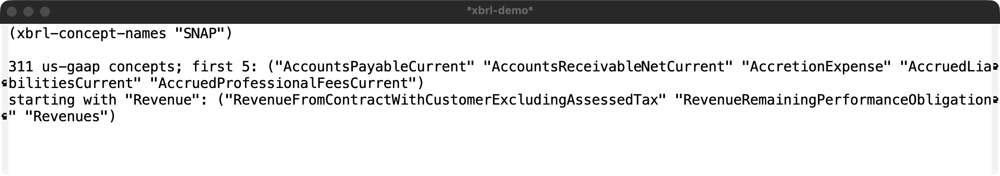
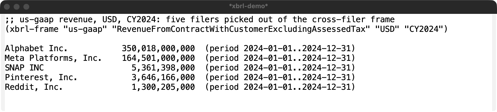

# xbrl.el showcase

Four worked examples built on a real annual report: Snap Inc (ticker `SNAP`,
CIK 1564408), a normal Form 10-K filer using the `us-gaap` taxonomy.

All output below was produced by the package against live SEC data on
2026-10-03 and is also pinned, offline, in `test/xbrl-test.el` with trimmed
real responses from `test/fixtures/` (see the fixtures README for exact SEC
URLs). Screenshots are of a real GUI Emacs window (macOS `screencapture -l`),
showing the text the code returned: examples 1 to 3 are the result string
inserted into a buffer, example 4 is the package's own `*xbrl*` table.

Setup:

    (require 'xbrl)
    (setq xbrl-user-agent "Your Name you@example.com") ; SEC requires this

## 1. Revenue + net loss = net margin by year

Snap's revenue lives under `RevenueFromContractWithCustomerExcludingAssessedTax`
(see example 2 for how to find that). `xbrl-annual` returns one latest-filed
10-K fact per fiscal year for each concept; join them on period end year:

```elisp
(let ((rev (xbrl-annual "SNAP" "RevenueFromContractWithCustomerExcludingAssessedTax"))
      (ni  (xbrl-annual "SNAP" "NetIncomeLoss")))
  (cl-loop for r in rev
           for n = (seq-find (lambda (x) (equal (substring (plist-get x :end) 0 4)
                                                (substring (plist-get r :end) 0 4)))
                             ni)
           when n
           collect (list (substring (plist-get r :end) 0 4)
                         (plist-get r :val) (plist-get n :val)
                         (* 100.0 (/ (float (plist-get n :val)) (plist-get r :val))))))
```

Output (USD; year, revenue, net income, margin %):

```
2016  revenue    404,482,000  net income    -514,643,000  margin -127.2%
2017  revenue    824,949,000  net income  -3,445,066,000  margin -417.6%
2018  revenue  1,180,446,000  net income  -1,255,911,000  margin -106.4%
2019  revenue  1,715,534,000  net income  -1,033,660,000  margin  -60.3%
2020  revenue  2,506,626,000  net income    -944,839,000  margin  -37.7%
2021  revenue  4,117,048,000  net income    -487,955,000  margin  -11.9%
2022  revenue  4,601,847,000  net income  -1,429,653,000  margin  -31.1%
2023  revenue  4,606,115,000  net income  -1,322,485,000  margin  -28.7%
2024  revenue  5,361,398,000  net income    -697,856,000  margin  -13.0%
2025  revenue  5,931,447,000  net income    -460,489,000  margin   -7.8%
```



## 2. Discover concept names

```elisp
(xbrl-concept-names "SNAP")
```

Returns 311 sorted us-gaap names. Those starting with "Revenue":

```
("RevenueFromContractWithCustomerExcludingAssessedTax"
 "RevenueRemainingPerformanceObligation" "Revenues")
```

Snap reported `Revenues` only through fiscal 2017 (companyconcept returns just
three annual values for it); later years use the
`RevenueFromContractWithCustomerExcludingAssessedTax` name, which is why
discovery matters.



## 3. Cross-filer comparison with a frame

`xbrl-frame` returns one concept for every filer in a calendar period (2970
rows here). This narrows CY2024 revenue to Snap and four other
internet-advertising companies by CIK:

```elisp
(let ((rows (seq-filter (lambda (r) (memq (plist-get r :cik)
                                          '(1564408 1326801 1506293 1713445 1652044)))
                        (xbrl-frame "us-gaap"
                                    "RevenueFromContractWithCustomerExcludingAssessedTax"
                                    "USD" "CY2024"))))
  (sort rows (lambda (a b) (> (plist-get a :val) (plist-get b :val)))))
```

```
Alphabet Inc.           350,018,000,000  (period 2024-01-01..2024-12-31)
Meta Platforms, Inc.    164,501,000,000  (period 2024-01-01..2024-12-31)
SNAP INC                  5,361,398,000  (period 2024-01-01..2024-12-31)
Pinterest, Inc.           3,646,166,000  (period 2024-01-01..2024-12-31)
Reddit, Inc.              1,300,205,000  (period 2024-01-01..2024-12-31)
```



## 4. Browse a concept as a table

```elisp
(xbrl-show-concept "SNAP" "RevenueFromContractWithCustomerExcludingAssessedTax")
;; or interactively: M-x xbrl-show-facts, pick SNAP, then complete a concept
```

Opens the `*xbrl*` table (sortable columns) with period end, value, unit, the
filing date and the accession number of the 10-K that last reported each year.


